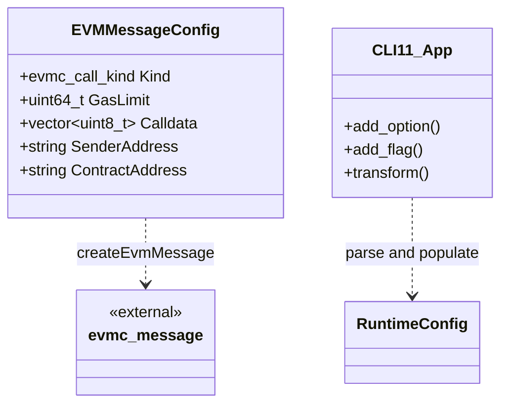

# cli Module Data Model

## Entity Relationship Diagram (Mermaid classDiagram)

Note: `EVMMessageConfig` is a DTO defined in the cli module for constructing `evmc_message`; `CLI11_App` represents the CLI11 parser, which maps command-line arguments to internal types.

## Core Entities

### EVMMessageConfig

Used only under `ZEN_ENABLE_EVM`, a local struct in `src/cli/dtvm.cpp` describing the message configuration for a single EVM call.

| Field | Type | Description |
|------|------|------|
| `Kind` | `evmc_call_kind` | `EVMC_CREATE` (deploy) or `EVMC_CALL` (invoke) |
| `GasLimit` | `uint64_t` | Gas limit |
| `Calldata` | `std::vector<uint8_t>` | Call data (after hex decoding) |
| `SenderAddress` | `std::string` | Sender address hex string |
| `ContractAddress` | `std::string` | Target contract address hex string in call mode |

Converted to standard `evmc_message` via `createEvmMessage(MockedHost, EVMMessageConfig, Bytecode)`.

## Enumerations

### Command-Line to Internal Type Mapping (defined in cli)

| Map Name | Key Type | Value Type | Purpose |
|--------|--------|--------|------|
| `FormatMap` | `std::string` | `InputFormat` | `wasm` → `WASM`, `evm` → `EVM` |
| `ModeMap` | `std::string` | `RunMode` | `interpreter`, `singlepass` (non-EVM), `multipass` |
| `LogMap` | `std::string` | `LoggerLevel` | `trace`, `debug`, `info`, `warn`, `error`, `fatal`, `off` |
| `EvmRevisionMap` | `std::string` | `evmc_revision` | `frontier` ~ `osaka` and other EVM hard fork versions |

All maps use `CLI::CheckedTransformer` for case-insensitive conversion.

### Enumerations Referenced from Other Modules

| Enum | Module | Description |
|------|------|------|
| `InputFormat` | common | `WASM`, `EVM` |
| `RunMode` | common | `InterpMode`, `SinglepassMode`, `MultipassMode`, `UnknownMode` |
| `LoggerLevel` | utils | `Trace`, `Debug`, `Info`, `Warn`, `Error`, `Fatal`, `Off` |
| `evmc_call_kind` | evmc | `EVMC_CALL`, `EVMC_CREATE`, `EVMC_CREATE2` |
| `evmc_revision` | evmc | `EVMC_FRONTIER` ~ `EVMC_OSAKA` |
| `evmc_status_code` | evmc | Execution result status, used directly as EVM mode process exit code |

## DTO / Shared Types

### Local Variables After Command-Line Parsing (Conceptual DTO)

Variables obtained in `main()` after parsing; conceptually the "command-line DTO":

| Variable | Type | Option | Default |
|------|------|----------|--------|
| `Filename` | `std::string` | `INPUT_FILE` | Required |
| `FuncName` | `std::string` | `-f/--function` | Empty |
| `EntryHint` | `std::string` | `--entry-hint` | Empty |
| `Calldata` | `std::string` | `--calldata` | Empty |
| `Args` | `std::vector<std::string>` | `--args` | Empty |
| `Envs` | `std::vector<std::string>` | `--env` | Empty |
| `Dirs` | `std::vector<std::string>` | `--dir` | Empty |
| `SaveStateFile` | `std::string` | `--save-state` | Empty |
| `LoadStateFile` | `std::string` | `--load-state` | Empty |
| `GasLimit` | `uint64_t` | `--gas-limit` | `UINT64_MAX` |
| `LogLevel` | `LoggerLevel` | `--log-level` | `Info` |
| `NumExtraCompilations` | `uint32_t` | `--num-extra-compilations` | 0 |
| `NumExtraExecutions` | `uint32_t` | `--num-extra-executions` | 0 |
| `EnableBenchmark` | `bool` | `--benchmark` | false |
| `DeployMode` | `bool` | `--deploy` | false |
| `ContractAddress` | `std::string` | `--contract-address` | Empty |
| `SenderAddress` | `std::string` | `--sender` | `"1000...0000"` (20 zero bytes) |
| `Config` | `RuntimeConfig` | Multiple options | See runtime module |
| `EvmRevision` | `evmc_revision` | `--evm-revision` | `zen::evm::DEFAULT_REVISION` |

### External DTO References

| Type | Module | Purpose |
|------|------|------|
| `RuntimeConfig` | runtime | Runtime configuration, populated by CLI options |
| `TypedValue` | common | WASM function return value, output via `printTypedValueArray` |
| `evmc_message` | evmc | EVM call message |
| `evmc::Result` | evmc | EVM execution result, contains `status_code`, `output_data`, `output_size` |
