# common Module Data Model

## Entity Relationship Diagram

```mermaid
classDiagram
    class Error {
        +ErrorPhase Phase
        +ErrorSubphase Subphase
        +uint16_t Priority
        +ErrorCode ErrCode
        +const char* Message
        +std::string ExtraMessage
        +what() const
        +isEmpty() const
        +getFormattedMessage(bool WithPrefix) const
        +getPhase() / setPhase()
        +getSubphase() / setSubphase()
        +getCode() / getMessage() / getExtraMessage()
    }

    class MayBe~T~ {
        +hasValue() const
        +getValue() / getError()
        +operator bool()
        +operator*() / operator->()()
    }

    class ConstStringPool {
        -MemPool MPool
        -ConstStringEntry** EntriesArray
        -uint32_t* StrHashTable
        -int32_t HashTableSize
        -int32_t EntriesCount
        -int32_t FreeIndex
        +initPool() bool
        +destroyPool() void
        +newSymbol(Str, Len) WASMSymbol
        +freeSymbol(Sym) void
        +probeSymbol(Str, Len) WASMSymbol const
        +dumpSymbolString(Sym) const char*
        +getNumSymbols() int32_t
    }

    class ConstStringEntry {
        +int32_t RefCount
        +uint32_t Len
        +uint32_t Hash
        +uint32_t HashNext
        +uint8_t Str8[0]
    }

    ConstStringPool --> ConstStringEntry : manages
    ConstStringPool --> SysMemPool : uses

    class MemPool~kind~ {
        <<template>>
        +allocate(Size, Align?, Hint?) void*
        +deallocate(Ptr, Size?) void
        +push() / pop(Mark) void
        +New~T~() T*
        +Delete~T~() void
    }

    class SysMemPool {
        +allocate(Size, Align?, TypeName?) void*
        +allocateZeros(Size, Align?, TypeName?) void*
        +deallocate(Ptr) void
        +reallocate(OldPtr, OldSize, NewSize) void*
        +newObject~T~() T*
        +deleteObject~T~() void
    }

    class CodeMemPool {
        +allocate(Size, Align) void*
        +getMemStart() / getMemEnd() / getMemPageEnd() uint8_t* const
    }

    MemPool~SYS_POOL~ --> SysMemPool
    MemPool~CODE_POOL~ --> CodeMemPool

    class CallThreadState {
        -runtime::Instance* Inst
        -FrameCapture StartFrame
        -CallThreadState* Parent
        -jmp_buf* JmpBuf
        -void* TrapFrameAddr
        -void* PC
        -void* FaultingAddress
        -uint64_t CurGasRegisterValue
        -std::vector~void*~ Traces
        +current() CallThreadState*
        +getTrapState() TrapState
        +setJITTraces() void
        +jmpToMarked(Signum) void
        +setHandler() / stopHandler() / restartHandler()
    }

    class EVMCallThreadState {
        -runtime::EVMInstance* Inst
        -FrameCapture StartFrame
        -EVMCallThreadState* Parent
        +current() EVMCallThreadState*
        +getTrapState() EVMTrapState
        +setJITTraces() void
    }

    CallThreadState --> TrapState : produces
    EVMCallThreadState --> EVMTrapState : produces

    class TrapState {
        +void* PC
        +void* FrameAddr
        +void* FaultingAddress
        +uint32_t NumIgnoredFrames
        +const std::vector~void*~* Traces
    }

    class EVMTrapState {
        +void* PC
        +void* FrameAddr
        +void* FaultingAddress
        +uint32_t NumIgnoredFrames
        +const std::vector~void*~* Traces
    }

    class FrameCapture {
        +void* PC
        +void* FrameAddr
    }

    class ThreadPool~ThreadContext~ {
        -std::queue~function~ Tasks
        -std::unique_ptr~std::thread[]~ Threads
        -std::unique_ptr~ThreadContext*[]~ Contexts
        -std::atomic~size_t~ TasksTotal
        +pushTask(Task) void
        +setThreadContext(ThreadId, Ctx, TailTask?) void
        +waitForTasks() void
        +reset(TC?) void
        +interrupt() void
        +getTasksQueued() / getTasksRunning() / getTasksTotal() size_t
    }

    class TypedValue {
        +UntypedValue Value
        +WASMType Type
    }

    class UntypedValue {
        +int32_t I32
        +int64_t I64
        +float F32
        +double F64
    }

    class EVMU256Type {
        +static BIT_WIDTH = 256
        +static ELEMENTS_COUNT = 4
        +getInnerTypes() U256InnerTypes const
        +getInnerType(index) WASMType const*
    }

    class V128 {
        +int8_t I8x16[16]
        +int16_t I16x8[8]
        +int32_t I32x8[4]
        +int64_t I64x2[2]
        +float F32x4[4]
        +double F64x2[2]
    }

    Error ..> ErrorCode : uses
    Error ..> ErrorPhase : uses
    Error ..> ErrorSubphase : uses
    MayBe~T~ --> Error : wraps
```



## Core Entities

### Error

Error type defined in `common/errors.h`, inherits `std::exception`.

| Field | Type | Description |
|------|------|------|
| Phase | ErrorPhase | Error phase |
| Subphase | ErrorSubphase | Subphase (mainly for multipass JIT) |
| Priority | uint16_t | Priority |
| ErrCode | ErrorCode | Error code |
| Message | const char* | Fixed message |
| ExtraMessage | std::string | Additional message |

Main methods: `what()`, `isEmpty()`, `getFormattedMessage(WithPrefix)`, `getPhase()` / `setPhase()`, `getCode()`, `getMessage()`, `getExtraMessage()`, `setExtraMessage()`.

### MayBe\<T\>

`common/errors.h`, pointer type `T` only. Wraps "value or error", supports structured binding `auto& [val, err] = maybe`.

| Method | Description |
|------|------|
| hasValue() | Whether value exists (no error) |
| getValue() | Get value (asserts hasValue) |
| getError() | Get Error |
| operator bool() | Equivalent to hasValue() |

### ConstStringPool

`common/const_string_pool.h/cpp`, FNV-1a hash-based constant string pool.

| Internal Field | Type | Description |
|----------|------|------|
| HashTableSize | int32_t | Hash table size (power of 2) |
| StrHashTable | uint32_t* | Hash buckets |
| EntriesCount | int32_t | Valid entry count |
| EntriesSize | int32_t | Entry array capacity |
| EntriesArray | ConstStringEntry** | Entry array, index is WASMSymbol |
| FreeIndex | int32_t | Free list head |
| MPool | SysMemPool | Memory source |

### ConstStringEntry

Defined in `common/const_string_pool.cpp`, flexible array member.

| Field | Type | Description |
|------|------|------|
| RefCount | int32_t | Reference count |
| Len | uint32_t | String length |
| Hash | uint32_t | FNV-1a hash value |
| HashNext | uint32_t | Hash collision chain |
| Str8 | uint8_t[0] | Null-terminated string |

### MemPool Family

| Entity | Strategy | Description |
|------|------|------|
| MemPool\<SYS_POOL\> (SysMemPool) | malloc/free | Supports reallocate, newObject/deleteObject, leak tracking in NDEBUG |
| MemPool\<CODE_POOL\> (CodeMemPool) | mmap | Code cache, per-page mprotect, thread-safe, MaxCodeSize configurable |
| MemPool\<ALLOC_ONLY_POOL\> | Block alloc | Currently stub implementation |
| MemPool\<STAGED_ALLOC_ONLY_POOL\> | - | Not implemented |

### CallThreadState / EVMCallThreadState

Valid under `ZEN_ENABLE_CPU_EXCEPTION`, thread-local storage for JIT trap handling.

| Field/Method | Description |
|-----------|------|
| Inst | Associated Instance / EVMInstance |
| StartFrame | Call entry frame (PC + FrameAddr) |
| Parent | Parent call TLS |
| JmpBuf | setjmp/longjmp buffer |
| TrapFrameAddr, PC, FaultingAddress | Stack frame and fault address when trap occurred |
| CurGasRegisterValue | Gas register value at trap |
| Traces | JIT stack trace result |
| current() | Get current thread TLS |
| getTrapState() | Build TrapState / EVMTrapState |
| setJITTraces() | Generate Traces from stack frames |
| jmpToMarked(Signum) | longjmp rollback |

### TrapState / EVMTrapState

| Field | Type | Description |
|------|------|------|
| PC | void* | Faulting instruction address |
| FrameAddr | void* | Stack frame address (e.g., rbp) |
| FaultingAddress | void* | Faulting memory address (e.g., si_addr) |
| NumIgnoredFrames | uint32_t | Frames to ignore during trace |
| Traces | const std::vector\<void*\>* | JIT stack trace |

### ThreadPool\<ThreadContext\>

`common/thread_pool.h`, generic thread pool.

| Method/Field | Description |
|-----------|------|
| pushTask(Task) | Submit task, Task accepts `ThreadContext*` |
| setThreadContext(ThreadId, Ctx, TailTask?) | Bind context and tail task to thread |
| waitForTasks() | Wait for all tasks to complete |
| setNoNewTask() | Disallow new tasks |
| reset(TC?) | Destroy and rebuild thread pool |
| interrupt() | Immediate termination |
| getTasksQueued/Running/Total() | Task statistics |
| getThreadCount() | Thread count |

### TypedValue / UntypedValue

`common/type.h`, WASM stack value representation.

| Type | Field | Description |
|------|------|------|
| UntypedValue | I32, I64, F32, F64 | Union, default I64=0 |
| TypedValue | Value: UntypedValue, Type: WASMType | Typed value |

### EVMU256Type

`common/type.h`, WASM representation of EVM U256 (4×I64).

| Constant/Method | Description |
|-----------|------|
| BIT_WIDTH | 256 |
| ELEMENTS_COUNT | 4 |
| getInnerTypes() | Return array of 4 I64 type pointers |
| getInnerType(index) | Get inner type at index |

### V128

`common/type.h`, 128-bit vector union, supports I8x16, I16x8, I32x4, I64x2, F32x4, F64x2 views.

## Enumerations

### ErrorPhase

```cpp
enum class ErrorPhase : uint8_t {
  Unspecified = 0, BeforeLoad, Load, Instantiation,
  Compilation, BeforeExecution, Execution
};
```

### ErrorSubphase

```cpp
enum class ErrorSubphase : uint8_t {
  None = 0, Lexing, Parsing, ContextInit, MIREmission,
  MIRVerification, CgIREmission, RegAlloc, MCEmission, ObjectEmission
};
```

### ErrorCode

Expanded from `errors.def` macros, includes NoError and per-phase error codes; under `ZEN_ENABLE_DWASM` additionally FirstDWasmError ~ LastDWasmError; Malformed class is FirstMalformedError ~ LastMalformedError.

### ExportKind / ImportKind

Expanded from `export.def` / `import.def`: FUNC(0), TABLE(1), MEMORY(2), GLOBAL(3).

### NameSectionType

Expanded from `sectype.def`: MODULE, FUNCTION, LOCAL, LABEL, TYPE, TABLE, MEMORY, GLOBAL, ELEMSEG, DATASEG, TAG, etc.

### SectionType / SectionOrder

Expanded from `sectype.def`: CUSTOM, TYPE, IMPORT, FUNC, TABLE, MEMORY, GLOBAL, EXPORT, START, ELEM, CODE, DATA, DATACOUNT, etc.

### Opcode

Expanded from `opcode.def`, covers WASM spec opcodes (e.g., UNREACHABLE, NOP, BLOCK, LOOP, IF, END, BR, CALL, I32_LOAD, etc.).

### LabelType

```cpp
enum LabelType { LABEL_BLOCK, LABEL_LOOP, LABEL_IF, LABEL_FUNCTION };
```

### InputFormat

```cpp
enum class InputFormat { WASM = 0, EVM };
```

### RunMode

```cpp
enum class RunMode {
  InterpMode = 0, SinglepassMode = 1, MultipassMode = 2, UnknownMode = 3
};
```

### MemPoolKind

```cpp
enum MemPoolKind {
  SYS_POOL,               // malloc/free
  ALLOC_ONLY_POOL,
  STAGED_ALLOC_ONLY_POOL,
  CODE_POOL              // mmap code cache
};
```

### BinaryOperator

Expanded from `operators.h` macros: BO_ADD, BO_AND, BO_DIV, BO_MUL, BO_OR, BO_SHL, BO_SHR_S, BO_SHR_U, BO_SUB, BO_XOR, etc.

### CompareOperator

Expanded from `operators.h` macros: CO_EQZ, CO_EQ, CO_GE, CO_GE_S, CO_GE_U, CO_GT, CO_GT_S, CO_GT_U, CO_LE, CO_LT, CO_NE, etc.

### UnaryOperator

Expanded from `operators.h` macros: UO_ABS, UO_CEIL, UO_CLZ, UO_CTZ, UO_FLOOR, UO_NEAREST, UO_NEG, UO_NOT, UO_POPCNT, UO_SQRT, UO_TRUNC, etc.

### WASMType

```cpp
enum class WASMType : uint8_t {
  VOID, I8, I16, I32, I64, F32, F64, FUNCREF, ANY, ERROR_TYPE
};
```

### WASMTypeKind

```cpp
enum class WASMTypeKind { INTEGER, FLOAT, VECTOR };
```

### WasmConstStringIdent

Expanded from `const_strings.def`: WASM_SYMBOL_NULL, WASM_SYMBOL_env, WASM_SYMBOL_memory, WASM_SYMBOL_table, etc., ending with WASM_SYMBOLS_END.

## DTO / Shared Types

| Type | Definition Location | Description |
|------|----------|------|
| WASMSymbol | defines.h (zen) | `uint32_t`, constant string pool symbol |
| EVMSymbol | defines.h (zen) | `uint32_t`, same as above |
| Optional\<T\> | platform.h (common) | std::optional or libcxx compatible |
| Nullopt | platform.h (common) | std::nullopt or compatible value |
| Byte, Bytes, StringView | platform.h (common) | std::byte, string_view compatible |
| SharedMutex, Mutex, LockGuard, etc. | platform.h | Mutex and lock types |

### defines.h Constants (Selected)

| Constant | Value | Description |
|------|-----|------|
| DefaultBytesNumPerPage | 65536 | Bytes per page |
| MaxLinearMemSize | 2^32 | Linear memory limit |
| WasmMagicNumber | 0x6d736100 | "\0asm" |
| WasmVersion | 0x1 | Version |
| PresetMaxNumMemories / PresetMaxNumTables | 1 | MVP limits |
| StackGuardSize | 16384 | Stack guard size |
| PresetMaxModuleSize, PresetMaxNumTypes, etc. | See defines.h | Module/function/table/memory limits |

### Templates and Metafunctions

| Template | Description |
|------|------|
| WASMTypeAttr\<WASMType\> | Type attributes: Type, Kind, Size, NumCells |
| FloatAttr\<float/double\> | Float-to-int boundary values toIntMax/toIntMin |
| getWASMTypeFromType\<T\>() | Infer WASMType from C++ type |
| getExchangedCompareOperator\<CO_xxx\>() | Invert comparison operator |
| MemPoolAllocator\<T, MemPoolType\> | STL-compliant allocator |
| Destroyer\<MemPoolType\> | unique_ptr deleter using MemPool::Delete |
| MemPoolUniquePtr\<T, MemPoolType\> | unique_ptr + Destroyer |
| SysMemPoolUniquePtr\<T\> | MemPoolUniquePtr\<T, SysMemPool\> |
