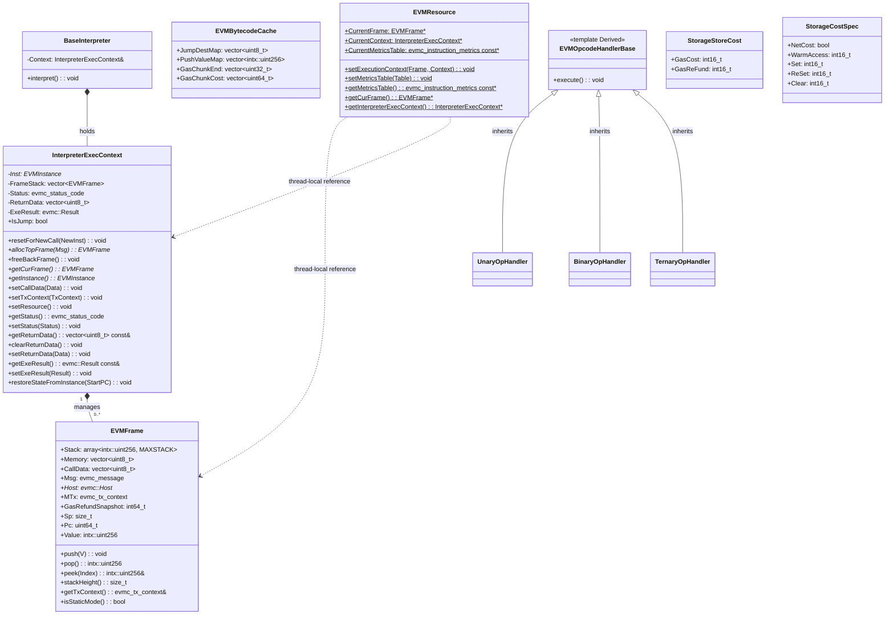

# evm Module Data Model

## Entity Relationship Diagram (Mermaid classDiagram)

## Core Entities (Key Fields and Methods)

### EVMFrame

Execution frame for a single EVM call.

| Field | Type | Description |
|------|------|------|
| Stack | `std::array<intx::uint256, MAXSTACK>` | Operand stack, max 1024 slots |
| Memory | `std::vector<uint8_t>` | Expandable byte memory |
| CallData | `std::vector<uint8_t>` | Call input data |
| Msg | `evmc_message` | Current message (kind, depth, gas, recipient, sender, value, etc.) |
| Host | `evmc::Host*` | Host interface pointer |
| MTx | `evmc_tx_context` | Transaction context (lazy-loaded) |
| GasRefundSnapshot | `int64_t` | Refund snapshot when frame was created |
| Sp | `size_t` | Stack top pointer |
| Pc | `uint64_t` | Program counter |
| Value | `intx::uint256` | Current value (in some scenarios) |

### InterpreterExecContext

Interpretation execution context, manages call stack and execution state.

| Method | Description |
|------|------|
| `allocTopFrame(Msg)` | Allocate new frame and push onto stack |
| `freeBackFrame()` | Pop top frame, write remaining Gas back to Instance |
| `getCurFrame()` | Get current top frame |
| `setResource()` | Set EVMResource Frame, Context, MetricsTable |
| `restoreStateFromInstance(StartPC)` | Restore stack, memory, PC from EVMInstance for JIT fallback |

### BaseInterpreter

Interpreter main loop, executes current frame via `interpret()` until STOP/RETURN/REVERT/exception.

### EVMBytecodeCache

Bytecode pre-analysis cache, filled by `buildBytecodeCache()`, used by interpreter and JIT.

| Field | Description |
|------|------|
| JumpDestMap | `[pc] -> 0/1` valid JUMPDEST |
| PushValueMap | `[pc] -> intx::uint256` PUSH immediate |
| GasChunkEnd | `[chunk_start_pc] -> chunk_end_pc` |
| GasChunkCost | `[chunk_start_pc] -> chunk_gas_cost` |

### EVMResource

Thread-local static access point for opcode handlers to get current Frame, Context, MetricsTable, avoiding parameter passing through layers.

## Enumerations

| Enum | Source | Description |
|------|------|------|
| `evmc_status_code` | evmc | EVMC_SUCCESS, EVMC_REVERT, EVMC_OUT_OF_GAS, EVMC_STACK_OVERFLOW, EVMC_STACK_UNDERFLOW, EVMC_UNDEFINED_INSTRUCTION, EVMC_INVALID_INSTRUCTION, EVMC_BAD_JUMP_DESTINATION, EVMC_INVALID_MEMORY_ACCESS, EVMC_STATIC_MODE_VIOLATION, etc. |
| `evmc_revision` | evmc | EVMC_FRONTIER, EVMC_HOMESTEAD, ..., EVMC_CANCUN, EVMC_PRAGUE, EVMC_OSAKA, EVMC_EXPERIMENTAL |
| `evmc_opcode` | evmc | OP_STOP, OP_ADD, ..., OP_PUSH1~OP_PUSH32, OP_DUP1~OP_DUP16, OP_SWAP1~OP_SWAP16, OP_CALL, OP_CREATE, OP_CREATE2, etc. |
| `evmc_storage_status` | evmc | EVMC_STORAGE_ADDED, EVMC_STORAGE_DELETED, EVMC_STORAGE_MODIFIED, etc., for SSTORE charging |

## DTO / Shared Types

| Type | Definition Location | Description |
|------|----------|------|
| `StorageStoreCost` | gas_storage_cost.h | `{ GasCost, GasReFund }`, SSTORE charging result |
| `StorageCostSpec` | gas_storage_cost.cpp | `{ NetCost, WarmAccess, Set, ReSet, Clear }`, per-revision storage spec |
| `SSTORE_COSTS` | gas_storage_cost | `[evmc_revision][evmc_storage_status] -> StorageStoreCost` lookup table |
| `STORAGE_COST_SPEC_TABLE` | gas_storage_cost.cpp | `[evmc_revision] -> StorageCostSpec` |
| `evmc_message` | evmc | Call message |
| `evmc_tx_context` | evmc | Transaction/block context |
| `evmc_instruction_metrics` | evmc | `{ gas_cost }` per-opcode Gas |

### evm.h Constants

| Constant | Value | Description |
|------|-----|------|
| MAXSTACK | 1024 | Stack depth limit |
| MAX_REQUIRED_MEMORY_SIZE | 16MB | Memory expansion limit |
| DEFAULT_REVISION | EVMC_CANCUN | Default revision |
| BASIC_EXECUTION_COST | 21000 | Base transaction Gas |
| COLD_ACCOUNT_ACCESS_COST | 2600 | EIP-2929 cold account access |
| WARM_ACCOUNT_ACCESS_COST | 100 | Warm account access |
| MAX_CODE_SIZE | 0x6000 | EIP-170 contract code size limit |
| MAX_SIZE_OF_INITCODE | 0xC000 | EIP-3860 initcode size limit |
| EMPTY_CODE_HASH | Fixed 32 bytes | Empty code Keccak256 |

### gas_storage_cost.h Constants

| Constant | Value | Description |
|------|-----|------|
| COLD_SLOAD_COST | 2100 | Cold SLOAD |
| WARM_STORAGE_READ_COST | 100 | Warm storage read |
| WORD_COPY_COST | 3 | Word copy cost |
| SSTORE_REQUIRED_ISTANBUL | 2300 | Minimum SSTORE Gas after Istanbul |
