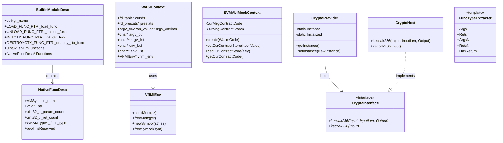

# host Module Data Model

## Entity Relationship Diagram (Mermaid classDiagram)



## Core Entities (Key Fields and Methods)

### BuiltinModuleDesc

Host module descriptor, loaded by runtime.

| Field | Type | Description |
|------|------|------|
| `_name` | `const char*` | Module name, e.g., "env", "wasi_snapshot_preview1", "spectest" |
| `_load_func` | `LOAD_FUNC_PTR` | On load, allocate `NativeFuncDesc` array and fill function info |
| `_unload_func` | `UNLOAD_FUNC_PTR` | On unload, free symbols and function type memory |
| `_init_ctx_func` | `INITCTX_FUNC_PTR` | On instantiation, create module context, return `void*` or `nullptr` |
| `_destroy_ctx_func` | `DESTROYCTX_FUNC_PTR` | On instance destruction, free context |
| `NumFunctions` | `uint32_t` | C-API reserved |
| `Functions` | `NativeFuncDesc*` | C-API reserved |

### NativeFuncDesc

Metadata for a single host function.

| Field | Type | Description |
|------|------|------|
| `_name` | `VMSymbol` | Symbol ID, created by `newSymbol` |
| `_ptr` | `void*` | Function pointer |
| `_param_count` | `uint32_t` | Parameter count |
| `_ret_count` | `uint32_t` | Return value count |
| `_func_type` | `WASMType*` | WASM type array for parameters and returns |
| `_isReserved` | `bool` | Whether reserved function (vnmi_init_ctx / vnmi_destroy_ctx) |

### WASIContext

WASI module instance-level context, created by `vnmi_init_ctx`.

| Field | Type | Description |
|------|------|------|
| `curfds` | `fd_table*` | WASM fd to native fd mapping |
| `prestats` | `fd_prestats*` | Pre-opened directory prestat info |
| `argv_environ` | `argv_environ_values*` | Command-line arguments and environment variables |
| `argv_buf` | `char*` | argv string buffer |
| `argv_list` | `char**` | argv pointer array |
| `env_buf` | `char*` | Environment variable string buffer |
| `env_list` | `char**` | Environment variable pointer array |
| `vnmi_env` | `VNMIEnv*` | For allocMem/freeMem |

### EVMAbiMockContext

EVM ABI Mock module contract-level context.

| Method | Signature | Description |
|------|------|------|
| `create` | `static shared_ptr create(vector<uint8_t>& WasmCode)` | Wrap Wasm code with 4-byte big-endian length prefix and create context |
| `setCurContractStore` | `void setCurContractStore(const string& Key, const vector<uint8_t>& Value)` | Set storage slot, Key is bytes32 hex (no 0x) |
| `getCurContractStore` | `const vector<uint8_t>& getCurContractStore(const string& Key)` | Read storage slot, returns 32 zero bytes if not found |
| `getCurContractCode` | `const vector<uint8_t>& getCurContractCode()` | Return current contract code (with prefix) |

### CryptoInterface / CryptoHost / CryptoProvider

EVM Keccak-256 cryptography abstraction.

| Class | Method | Description |
|----|------|------|
| `CryptoInterface` | `keccak256(Input, InputLen, Output)` | Pure virtual, compute hash into Output (at least 32 bytes) |
| `CryptoInterface` | `keccak256(Input)` | Pure virtual, return 32-byte vector |
| `CryptoHost` | Same as above | Implementation using `ethash::keccak256` |
| `CryptoProvider` | `getInstance()` | Singleton access, lazy initialization |
| `CryptoProvider` | `setInstance(unique_ptr)` | Inject custom implementation |

## Enumerations

### WASI Related (from wasmtime_ssp.h)

| Enum/Macro | Value Examples | Description |
|--------|--------|------|
| `__wasi_errno_t` | `__WASI_ESUCCESS`, `__WASI_EBADF`, `__WASI_EFAULT`, etc. | WASI error codes |
| `__wasi_clockid_t` | `__WASI_CLOCK_REALTIME`, `__WASI_CLOCK_MONOTONIC` | Clock ID |
| `__wasi_filetype_t` | `__WASI_FILETYPE_DIRECTORY`, `__WASI_FILETYPE_REGULAR_FILE` | File type |
| `__wasi_fdflags_t` | `__WASI_FDFLAG_APPEND`, `__WASI_FDFLAG_SYNC` | File descriptor flags |
| `__wasi_whence_t` | `__WASI_WHENCE_SET`, `__WASI_WHENCE_CUR`, `__WASI_WHENCE_END` | Seek basis |
| `__wasi_preopentype_t` | `__WASI_PREOPENTYPE_DIR` | Pre-open type |
| `__wasi_signal_t` | `__WASI_SIGKILL`, `__WASI_SIGSEGV`, etc. | Signal numbers |

### ErrorCode (common module, used by host)

| Value | Description |
|----|------|
| `EnvAbort` | Host API abnormal termination |
| `WASIProcRaise` | WASI proc_raise received signal |
| `InstanceExit` | Instance normal exit or exit via finish |

## DTO / Shared Types

### wasi_prestat_app_t

WASI pre-open directory info application-side layout (32-bit compatible).

```c
typedef struct wasi_prestat_app {
  wasi_preopentype_t pr_type;
  uint32_t pr_name_len;
} wasi_prestat_app_t;
```

### iovec_app_t

WASI iovec/ciovec application-side layout (uses offset instead of pointer).

```c
typedef struct iovec_app {
  uint32_t buf_offset;
  uint32_t buf_len;
} iovec_app_t;
```

### ethash_hash256

Keccak-256 output type (from hash_types.h).

```c
union ethash_hash256 {
  uint64_t word64s[4];
  uint32_t word32s[8];
  uint8_t bytes[32];
  char str[32];
};
```

### VNMI Reserved Function Signatures

```c
typedef void *(*VNMI_RESERVED_INIT_CTX_TYPE)(
    VNMIEnv *vmenv, const char *dir_list[], uint32_t dir_count,
    const char *envs[], uint32_t env_count, char *env_buf,
    uint32_t env_buf_size, char *argv[], uint32_t argc, char *argv_buf,
    uint32_t argv_buf_size);
typedef void (*VNMI_RESERVED_DESTROY_CTX_TYPE)(VNMIEnv *vmenv, void *ctx);
```
