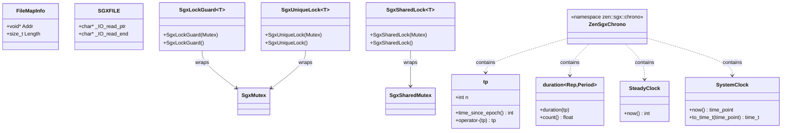

# platform Module Data Model

## Entity Relationship Diagram

## Core Entities

### FileMapInfo

**Location**: `map.h`, namespace `zen::platform`

| Field | Type | Description |
|------|------|------|
| `Addr` | `void *` | Start address of mapped region |
| `Length` | `size_t` | Byte length of mapped region |

Represents the mapping result of a successful `mapFile` call, used by `unmapFile`.

---

### SGXFILE

**Location**: `sgx/zen_sgx_file.h` (C type)

| Field | Type | Description |
|------|------|------|
| `_IO_read_ptr` | `char *` | Current read pointer |
| `_IO_read_end` | `char *` | End of read buffer |

FILE-like handle in SGX environment, replaces `std::FILE`. Global instances: `sgx_stdout`, `sgx_stderr`.

---

### SgxMutex / SgxSharedMutex

**Location**: `sgx/zen_sgx_thread.h`

Empty classes, placeholder types for mutex and read-write lock under SGX, no members. Not compatible with `std::mutex`, `std::shared_timed_mutex` interfaces, used only for type alias unification.

---

### SgxLockGuard\<Mutex\> / SgxSharedLock\<Mutex\> / SgxUniqueLock\<Mutex\>

**Location**: `sgx/zen_sgx_thread.h`

| Class | Construction |
|----|------|
| `SgxLockGuard` | `SgxLockGuard(Mutex Mtx)`, `SgxLockGuard()` |
| `SgxSharedLock` | `SgxSharedLock(Mutex Mtx)`, `SgxSharedLock()` |
| `SgxUniqueLock` | `SgxUniqueLock(Mutex Mtx)`, `SgxUniqueLock()` |

RAII lock guard placeholders under SGX; no lock acquisition on construction, no destructor logic.

---

### zen::sgx::chrono

**Location**: `sgx/zen_sgx_time.h`

SGX replacement for `std::chrono`, simplified time types:

| Type | Description |
|------|------|
| `tp` | Time point, with `int n`; `time_since_epoch()` returns 0; supports `operator-` |
| `duration<Rep, Period>` | Duration, constructed from `tp`, `count()` returns 0.0 |
| `milliseconds` | `uint64_t count()` returns 0 |
| `SteadyClock` | `time_point` is `tp`, `now()` returns 0 |
| `SystemClock` | `time_point` is `tp`, `now()` returns default `time_point`, `to_time_t` returns 0 |
| `duration_cast<T>(int v)` | Returns `T{}` |

Mainly for compilation; actual time semantics provided by host or upper layer.

## Enumerations

### Memory Protection and Mapping Flags

**Location**: `sgx/zen_sgx_mman.h` (anonymous enum)

| Name | Value | Description |
|------|-----|------|
| `PROT_NONE` | 0 | Not accessible |
| `PROT_READ` | 1 | Readable |
| `PROT_WRITE` | 2 | Writable |
| `PROT_EXEC` | 4 | Executable |

**Location**: `sgx/zen_sgx_mman.h` (macros)

| Name | Value | Description |
|------|-----|------|
| `MAP_FILE` | 0x0 | File mapping (default) |
| `MAP_SHARED` | 0x01 | Shared mapping |
| `MAP_PRIVATE` | 0x02 | Private copy-on-write |
| `MAP_ANONYMOUS` | 0x20 | Anonymous mapping |
| `MAP_FAILED` | `(void *)-1` | `mmap` failure return value (defined in `zen_sgx_map.cpp`) |

### File Open Modes (`zen_sgx_file.h`)

| Macro Category | Examples | Description |
|--------|------|------|
| `O_RDONLY` / `O_WRONLY` / `O_RDWR` | 00 / 01 / 02 | Open mode |
| `O_CREAT` / `O_TRUNC` / `O_APPEND`, etc. | Various | Open options |
| `S_IFREG` / `S_IFDIR`, etc. | 0170000, etc. | File type |
| `SEEK_SET` / `SEEK_CUR` / `SEEK_END` | 0 / 1 / 2 | Seek basis |

Full set in `zen_sgx_file.h`.

## DTO / Shared Types

| Type | Definition Location | Purpose |
|------|----------|------|
| `FileMapInfo` | `map.h` | Pass mapping info across `mapFile` / `unmapFile` |
| `SGXFILE` | `zen_sgx_file.h` | Replace `std::FILE` under SGX, used by `STDFile` alias |
| `zen::common::Byte` | `platform.h` (from libcxx or std) | Byte type |
| `zen::common::Bytes` | `platform.h` | `basic_string_view<Byte>` |
| `zen::common::StringView` | `platform.h` | `string_view` |
| `zen::common::Optional<T>` | `platform.h` | `optional<T>` |
| `zen::common::Variant<T...>` | `platform.h` | `variant<T...>` |

These types are exposed via `platform.h` or `map.h` for use by `common`, `runtime`, `compiler`, `evm`, `singlepass`, `utils`, and other modules.
