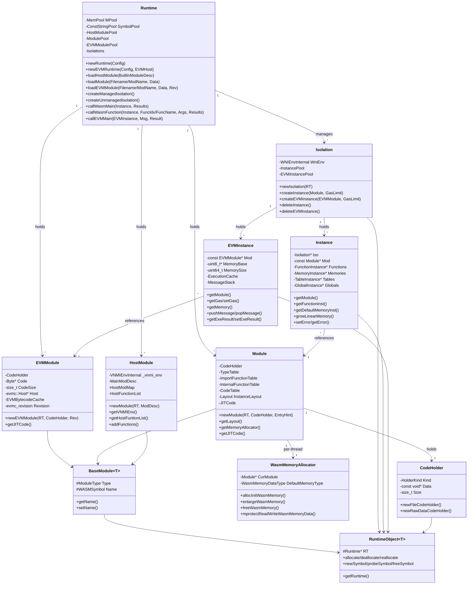

# Runtime Module Data Model

## Entity Relationship Diagram (Mermaid classDiagram)



## Core Entities (Key Fields and Methods)

### Runtime

| Field / Method | Description |
|----------------|-------------|
| `MPool` | System memory pool (SysMemPool) |
| `SymbolPool` | Constant string pool (ConstStringPool) |
| `HostModulePool` | `WASMSymbol -> HostModuleUniquePtr` |
| `ModulePool` | `WASMSymbol -> ModuleUniquePtr` |
| `EVMModulePool` | `EVMSymbol -> EVMModuleUniquePtr` (ZEN_ENABLE_EVM) |
| `Isolations` | `Isolation* -> IsolationUniquePtr` |
| `EVMHost` | evmc::Host* (ZEN_ENABLE_EVM) |
| `VMMaxMemPages` | Maximum linear memory pages for the VM |
| `Config` | RuntimeConfig |

### Module

| Field / Method | Description |
|----------------|-------------|
| `TypeTable` | TypeEntry* |
| `ImportFunctionTable` | ImportFunctionEntry* |
| `InternalFunctionTable` | FuncEntry* |
| `CodeTable` | CodeEntry* |
| `Layout` | InstanceLayout; computes Instance memory layout |
| `JITCode` / `JITCodeSize` | JIT compilation output (ZEN_ENABLE_JIT) |
| `ThreadLocalMemAllocatorMap` | Thread -> WasmMemoryAllocator* |

### Instance

| Field / Method | Description |
|----------------|-------------|
| `Mod` | Associated Module |
| `Iso` | Associated Isolation |
| `Functions` | FunctionInstance array |
| `Memories` | MemoryInstance array |
| `Tables` | TableInstance array |
| `Globals` | GlobalInstance array |
| `GlobalVarData` | Global variable storage |
| `Err` | common::Error |
| `Gas` | Gas limit / remaining |
| `JITFuncPtrs` / `FuncTypeIdxs` | JIT metadata (ZEN_ENABLE_JIT) |

### EVMInstance

| Field / Method | Description |
|----------------|-------------|
| `Mod` | Associated EVMModule |
| `Memory` | std::unique_ptr<uint8_t[]> |
| `MemoryBase` / `MemorySize` | Current memory base address and size |
| `EVMStack` | uint8_t[EVMStackCapacity] |
| `CurrentMessage` / `MessageStack` | evmc_message call stack |
| `ExeResult` | evmc::Result |
| `InstanceExecutionCache` | ExecutionCache (TxContext, BlockHashes, etc.) |
| `Gas` / `GasRefund` | Gas and refund |

### Isolation

| Field / Method | Description |
|----------------|-------------|
| `WniEnv` | WNIEnvInternal (WNI environment) |
| `InstancePool` | Instance* -> InstanceUniquePtr |
| `EVMInstancePool` | EVMInstance* -> EVMInstanceUniquePtr (ZEN_ENABLE_EVM) |

### WasmMemoryAllocator

| Field / Method | Description |
|----------------|-------------|
| `CurModule` | Associated Module |
| `DefaultMemoryType` | WasmMemoryDataType |
| `ActiveBuckets` | MmapBucketInstance map |
| `allocInitWasmMemory()` | Allocate initial linear memory |
| `enlargeWasmMemory()` | Grow memory |
| `freeWasmMemory()` | Free memory |

## Enumerations

### ModuleType

```cpp
enum class ModuleType { WASM, EVM, JIT, AOT, NATIVE };
```

### FunctionKind

```cpp
enum FunctionKind { ByteCode = 0, Jit, Aot, Native };
```

### WasmMemoryDataType

```cpp
enum WasmMemoryDataType : uint32_t {
  WM_MEMORY_DATA_TYPE_NO_DATA = 0,
  WM_MEMORY_DATA_TYPE_MALLOC = 1,
  WM_MEMORY_DATA_TYPE_SINGLE_MMAP = 2,
  WM_MEMORY_DATA_TYPE_BUCKET_MMAP = 3,
};
```

### CodeHolder::HolderKind

```cpp
enum class HolderKind { kFile, kRawData };
```

## DTO / Shared Types

### VNMIEnvInternal

```cpp
typedef struct VNMIEnvInternal_ {
  VNMIEnv _env;
  Runtime *_runtime;
} VNMIEnvInternal;
```

### WNIEnvInternal

```cpp
typedef struct WNIEnvInternal_ {
  WNIEnv _env;
  Runtime *_runtime;
} WNIEnvInternal;
```

### BuiltinModuleDesc (from vnmi.h)

| Field | Description |
|-------|-------------|
| `_name` | Module name |
| `_load_func` | LOAD_FUNC_PTR |
| `_unload_func` | UNLOAD_FUNC_PTR |
| `_init_ctx_func` | INITCTX_FUNC_PTR |
| `_destroy_ctx_func` | DESTROYCTX_FUNC_PTR |
| `Functions` | NativeFuncDesc* |
| `NumFunctions` | Function count |

### NativeFuncDesc (from vnmi.h)

| Field | Description |
|-------|-------------|
| `_name` | VMSymbol function name |
| `_ptr` | Function pointer |
| `_func_type` | WASMType* |
| `_param_count` | Parameter count |
| `_ret_count` | Return value count |
| `_isReserved` | Whether reserved |

### WasmMemoryData

```cpp
struct WasmMemoryData {
  WasmMemoryDataType Type;
  uint8_t *MemoryData;
  size_t MemorySize;
  bool NeedMprotect;
};
```

### FunctionInstance

| Field | Description |
|-------|-------------|
| `NumParams` / `NumLocals` | Parameter / local variable counts |
| `MaxStackSize` / `MaxBlockDepth` | Stack and block depth |
| `Kind` | FunctionKind |
| `CodePtr` | Bytecode pointer |
| `JITCodePtr` | JIT code pointer (ZEN_ENABLE_JIT) |
| `ReturnTypes` / `ParamTypes` | Type information |

### MemoryInstance

| Field | Description |
|-------|-------------|
| `CurPages` / `MaxPages` | Current / maximum page count |
| `MemSize` | Size in bytes |
| `MemBase` / `MemEnd` | Base and end address |
| `Kind` | WasmMemoryDataType |

### TableInstance

| Field | Description |
|-------|-------------|
| `CurSize` / `MaxSize` | Current / maximum element count |
| `Elements` | uint32_t* table entries |

### GlobalInstance

| Field | Description |
|-------|-------------|
| `Type` | WASMType |
| `Mutable` | Whether mutable |
| `Offset` | Offset in GlobalVarData |

### RuntimeConfig

| Field | Description |
|-------|-------------|
| `Format` | common::InputFormat |
| `Mode` | common::RunMode |
| `DisableWasmMemoryMap` | Whether to disable mmap |
| `EnableStatistics` | Whether to enable statistics |
| `DisableWASI` | Whether to disable WASI (ZEN_ENABLE_BUILTIN_WASI) |
| `EnableMultipassLazy` | Multipass lazy compilation (ZEN_ENABLE_MULTIPASS_JIT) |

### RuntimeObjectDestroyer and UniquePtr Types

```cpp
template <typename T> using RuntimeObjectUniquePtr = std::unique_ptr<T, RuntimeObjectDestroyer>;
using CodeHolderUniquePtr = RuntimeObjectUniquePtr<CodeHolder>;
using HostModuleUniquePtr = RuntimeObjectUniquePtr<HostModule>;
using ModuleUniquePtr = RuntimeObjectUniquePtr<Module>;
using InstanceUniquePtr = RuntimeObjectUniquePtr<Instance>;
using IsolationUniquePtr = RuntimeObjectUniquePtr<Isolation>;
using EVMModuleUniquePtr = RuntimeObjectUniquePtr<EVMModule>;  // ZEN_ENABLE_EVM
using EVMInstanceUniquePtr = RuntimeObjectUniquePtr<EVMInstance>;  // ZEN_ENABLE_EVM
```
