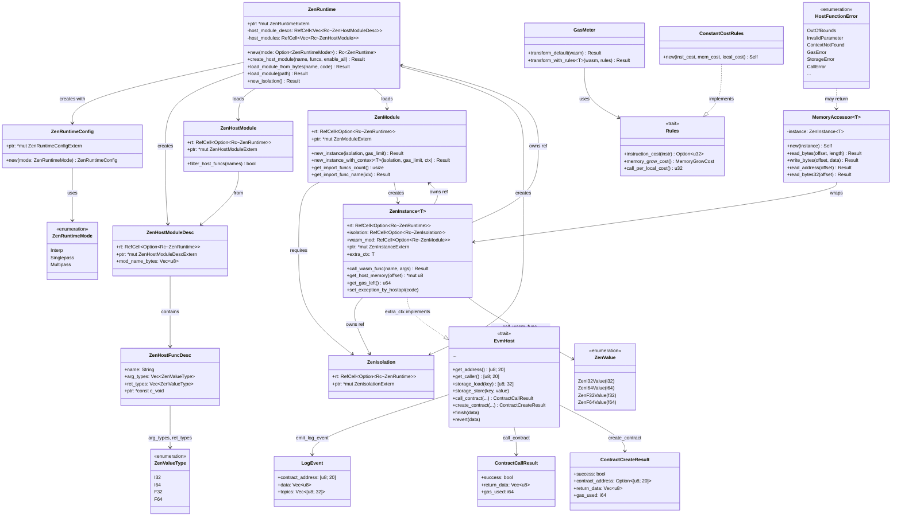

# Rust Bindings Module Data Model

## Entity Relationship Diagram (Mermaid classDiagram)

## Core Entities

### ZenRuntime

Runtime entry point; holds `ZenRuntimeExtern*`. Creates host modules, loads WASM modules, and creates isolations and instances. Default mode is Singlepass.

| Field | Type | Description |
|-------|------|-------------|
| ptr | `*mut ZenRuntimeExtern` | C runtime pointer |
| host_module_descs | `RefCell<Vec<Rc<ZenHostModuleDesc>>>` | Host module descriptions; must outlive runtime teardown |
| host_modules | `RefCell<Vec<Rc<ZenHostModule>>>` | Loaded host modules |

### ZenModule

WASM module wrapper; loaded from file or bytes. Can create instances with a gas limit; supports generic context `T`.

| Field | Type | Description |
|-------|------|-------------|
| rt | `RefCell<Option<Rc<ZenRuntime>>>` | Owning runtime |
| ptr | `*mut ZenModuleExtern` | C module pointer |

### ZenInstance&lt;T&gt;

WASM instance holding execution context. `T` is `extra_ctx`, typically implementing `EvmHost`. Uses `ZenSetInstanceCustomData` to store a pointer to self in the C instance so host functions can recover it via `ZenInstance::from_raw_pointer`.

| Field | Type | Description |
|-------|------|-------------|
| ptr | `*mut ZenInstanceExtern` | C instance pointer |
| extra_ctx | `T` | User context (e.g. MockContext) |
| rt, isolation, wasm_mod | `RefCell<Option<Rc<...>>>` | Dependent resource references |

### ZenHostFuncDesc

Host function descriptor for registration with the runtime. `ptr` is a function pointer of the form `extern "C" fn(*mut ZenInstanceExtern, ...)`.

| Field | Type | Description |
|-------|------|-------------|
| name | `String` | Export name (e.g. `getAddress`) |
| arg_types | `Vec<ZenValueType>` | Parameter types |
| ret_types | `Vec<ZenValueType>` | Return types |
| ptr | `*const c_void` | C function pointer |

## Enumerations

### ZenRuntimeMode

| Variant | C value | Description |
|---------|---------|-------------|
| Interp | 0 | Interpreter mode |
| Singlepass | 1 | Singlepass JIT |
| Multipass | 2 | Multipass JIT |

### ZenValueType

| Variant | C value | Description |
|---------|---------|-------------|
| I32 | 0 | 32-bit integer |
| I64 | 1 | 64-bit integer |
| F32 | 2 | 32-bit float |
| F64 | 3 | 64-bit float |

### ZenValue

| Variant | Description |
|---------|-------------|
| ZenI32Value(i32) | i32 value |
| ZenI64Value(i64) | i64 value |
| ZenF32Value(f32) | f32 value |
| ZenF64Value(f64) | f64 value |

### HostFunctionError

| Variant | Associated fields | Description |
|---------|-------------------|-------------|
| OutOfBounds | offset, length, message, function | Out-of-bounds memory |
| InvalidParameter | param, value, message, function | Invalid parameter |
| ContextNotFound | message, function | Missing context |
| MemoryAccessError | message, function | Memory access error |
| ExecutionError | message, function | Execution error |
| GasError | message, function, gas_requested, gas_available | Gas error |
| StorageError | message, function, key | Storage error |
| CallError | message, function, target_address | Call error |
| CryptoError | message, function, operation | Cryptographic error |
| ArithmeticError | message, function, operation | Arithmetic error |

### MemoryGrowCost

| Variant | Description |
|---------|-------------|
| Free | No per-page charge |
| Linear(NonZeroU32) | Fixed gas cost per page |

### TransformError

| Variant | Description |
|---------|-------------|
| Parse(elements::Error) | WASM parse failure |
| Inject(String) | Gas injection failure |
| Serialize(elements::Error) | WASM serialization failure |

## DTO / Shared Types

### ZenRuntimeConfigExtern / ZenRuntimeExtern / ZenModuleExtern / ZenIsolationExtern / ZenInstanceExtern

`#[repr(C)]` FFI opaque handles allocated and freed by the C library.

### ZenHostFuncDescExtern

| Field | Type | Description |
|-------|------|-------------|
| name | `*const c_char` | Function name as C string |
| num_args | `uint32_t` | Parameter count |
| arg_types | `*const uint32_t` | Parameter type array |
| num_returns | `uint32_t` | Return value count |
| ret_types | `*const uint32_t` | Return type array |
| ptr | `*const c_void` | Function pointer |

### ZenValueExtern

| Field | Type | Description |
|-------|------|-------------|
| value_type | `c_int` | 0=i32, 1=i64, 2=f32, 3=f64 |
| value | `int64_t` | Value (union semantics) |

### LogEvent

| Field | Type | Description |
|-------|------|-------------|
| contract_address | `[u8; 20]` | Contract address |
| data | `Vec<u8>` | Log data |
| topics | `Vec<[u8; 32]>` | Topics (up to 4) |

### ContractCallResult

| Field | Type | Description |
|-------|------|-------------|
| success | `bool` | Whether successful |
| return_data | `Vec<u8>` | Return data |
| gas_used | `i64` | Gas consumed |

### ContractCreateResult

| Field | Type | Description |
|-------|------|-------------|
| success | `bool` | Whether successful |
| contract_address | `Option<[u8; 20]>` | Created contract address |
| return_data | `Vec<u8>` | Return data |
| gas_used | `i64` | Gas consumed |

### ScopedMalloc&lt;T&gt;

RAII wrapper around `libc::malloc`; calls `free` on Drop.

### MeteredBlock (gas_inject)

| Field | Type | Description |
|-------|------|-------------|
| start_pos | `usize` | Injection position |
| cost | `u64` | Gas cost |
