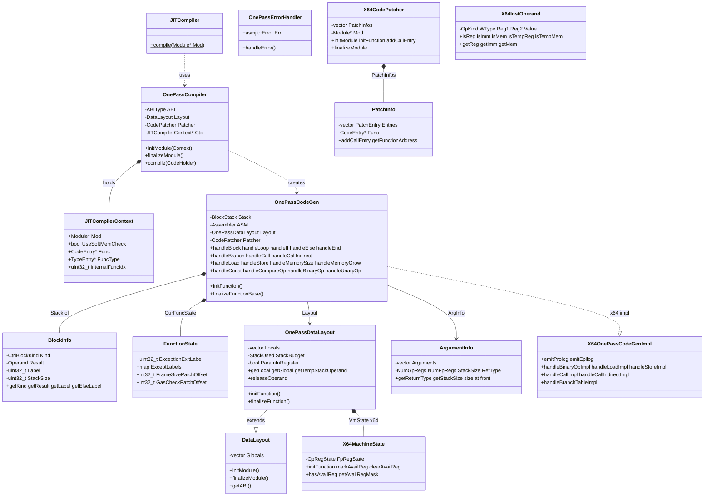

# singlepass Module Data Model

## Entity Relationship Diagram (Mermaid classDiagram)

## Core Entities (Key Fields and Methods)

### JITCompiler

| Member | Type | Description |
|------|------|------|
| `compile(Module *Mod)` | static void | Sole external interface, compiles all internal functions in module to JIT code |

### JITCompilerContext

| Field | Type | Description |
|------|------|------|
| `Mod` | `Module*` | Currently compiled WASM module |
| `UseSoftMemCheck` | `bool` | Whether to use software memory boundary check |
| `Func` | `CodeEntry*` | Current function's code entry |
| `FuncType` | `TypeEntry*` | Current function's type info |
| `InternalFuncIdx` | `uint32_t` | Internal function index (excluding imports) |

### OnePassCodeGen / BlockInfo

| Entity | Key Member | Description |
|------|----------|------|
| `BlockInfo` | `Kind` | CtrlBlockKind: FUNC_ENTRY / BLOCK / LOOP / IF |
| | `Result` | Block result operand |
| | `Label` | Block end label; for IF, Label+1 is else label |
| | `StackSize` | Stack size for block |

### FunctionState

| Field | Type | Description |
|------|------|------|
| `ExceptionExitLabel` | `uint32_t` | Exception exit label |
| `ExceptLabels` | `map<ErrorCode, asmjit::Label>` | Trap labels per error code |
| `FrameSizePatchOffset` | `int32_t` | Prolog frame size patch offset |
| `GasCheckPatchOffset` | `int32_t` | Gas check patch offset (if used) |

### X64OnePassDataLayout / LocalInfo

| Entity | Key Member | Description |
|------|----------|------|
| `LocalInfo` | `Type` | WASM type |
| | `Reg` | Register number (if in register) |
| | `Offset` | Stack frame offset (if on stack) |
| `X64OnePassDataLayout` | `VmState` | X64MachineState, tracks register availability |
| | `StackIncrement` | Stack growth step 32 bytes |

### X64CodePatcher / PatchInfo

| Entity | Key Member | Description |
|------|----------|------|
| `PatchEntry` | `PatKind` | PKCall |
| | `Ofst` | Patch offset (24bit) |
| | `PatSize` | Patch size (max 15 bytes) |
| | `PatArg` | Callee internal index |
| `X64CodePatcher` | `finalizeModule()` | Iterate PatchInfo, emit call rel32 encoding |

### X64MachineState

| Field | Type | Description |
|------|------|------|
| `GpRegParamState` | 6bit | Whether integer params in registers |
| `FpRegParamState` | 8bit | Whether float params in registers |
| `NativeStackSize` | 18bit | Native stack size |
| `GpRegState` | 16bit | Integer temp register availability |
| `FpRegState` | 16bit | Float temp register availability |

### X64InstOperand

| Field | Type | Description |
|------|------|------|
| `OpKind` | `uint8_t` | X64OperandKind combined with OperandFlags |
| `WType` | `WASMType` | WASM value type |
| `Reg1` | `uint8_t` | Primary/base register |
| `Reg2` | `uint8_t` | Index register (SIB form) |
| `Value` | `int32_t` | Immediate or offset |

## Enumerations

### CtrlBlockKind

| Value | Meaning |
|----|------|
| `FUNC_ENTRY` | Function entry block |
| `BLOCK` | Ordinary block |
| `LOOP` | loop block |
| `IF` | if block |

### X64OperandKind

| Value | Meaning |
|----|------|
| `OK_None` | No operand |
| `OK_Register` | Register |
| `OK_IntConst` | 32-bit integer immediate |
| `OK_BaseOffset` | Base plus offset |
| `OK_BaseIndexScale1/2/4/8` | Base plus index times scale plus offset |
| `OK_Label` | Label |
| `OK_Function` | Function |

### X64InstOperand::OperandFlags

| Value | Meaning |
|----|------|
| `FLAG_NONE` | No flag |
| `FLAG_TEMP_MEM` | Stack temporary |
| `FLAG_TEMP_REG` | Temporary register |

### PatchInfo::PatchKind

| Value | Meaning |
|----|------|
| `PKCall` | Direct call patch |

### X64::Type

| Value | Meaning |
|----|------|
| `I8` | 8-bit integer |
| `I16` | 16-bit integer |
| `I32` | 32-bit integer |
| `I64` | 64-bit integer |
| `F32` | 32-bit float |
| `F64` | 64-bit float |
| `V128` | 128-bit vector |
| `VOID` | Placeholder |

### ScopedTempReg Indices

| Value | Meaning |
|----|------|
| `ScopedTempReg0` | 0 |
| `ScopedTempReg1` | 1 |
| `ScopedTempReg2` | 2 |
| `ScopedTempRegLast` | 3 |

## DTO / Shared Types

### ArgumentInfo::Argument

| Field | Type | Description |
|------|------|------|
| `Type` | `WASMType` | Formal parameter type |
| `Reg` | `RegNumType` | Parameter register number |
| `Offset` | `uint16_t` | Stack offset |

### DataLayout::GlobalInfo

| Field | Type | Description |
|------|------|------|
| `Type` | `WASMType` | Global variable type |
| `Mutable` | `bool` | Whether mutable |
| `Offset` | `uint32_t` | Offset relative to global_data |

### OnePassDataLayout::LocalInfo

| Field | Type | Description |
|------|------|------|
| `Type` | `WASMType` | Local variable type |
| `Reg` | `uint32_t` | Register number (InvalidParamReg means on stack) |
| `Offset` | `int32_t` | Stack frame offset |

### FloatAttr (WASMType::F32 / F64)

Template specialization providing float-to-int boundary constants:

| Static Member | Description |
|----------|------|
| `IntType` | Corresponding integer type I32 or I64 |
| `NegZero` | Negative zero bit pattern |
| `CanonicalNan` | Canonical NaN bit pattern |
| `SignMask` | Sign bit mask |
| `int_max<Int>()` / `int_min<Int>()` | Signed bounds |
| `uint_max<Int>()` / `uint_min<Int>()` | Unsigned bounds |

### Instance Offset Constants (in OnePassCodeGen)

| Constant | Value | Description |
|------|-----|------|
| `GlobalBaseOffset` | offsetof(Instance, GlobalVarData) | Global data base |
| `MemoriesOffset` | offsetof(Instance, Memories) | Memory array |
| `MemoryBaseOffset` | offsetof(MemoryInstance, MemBase) | Memory base |
| `MemorySizeOffset` | offsetof(MemoryInstance, MemSize) | Memory size |
| `TablesOffset` | offsetof(Instance, Tables) | Table array |
| `TableSizeOffset` | offsetof(TableInstance, CurSize) | Table size |
| `TableBaseOffset` | offsetof(TableInstance, Elements) | Table element base |
| `FunctionPointersOffset` | offsetof(Instance, JITFuncPtrs) | JIT function pointer array |
| `ExceptionOffset` | offsetof(Instance, Err.ErrCode) | Exception code |
| `StackBoundaryOffset` | offsetof(Instance, JITStackBoundary) | Stack boundary |
| `GasLeftOffset` | offsetof(Instance, Gas) | Remaining Gas |
