# tests Module Data Model

## Entity Relationship Diagram (Mermaid classDiagram)

```mermaid
classDiagram
    class SpecTest {
        +CommandID resolveCommand(name)
        +enumerate() vector
        +findFilePath(category, unit, filename) string
        +compare(expected, got) bool
        +run(unitPair)
        +OnInstantiate ModuleCallback
        +OnTrapInstantiate InstantiateCallback
        +OnInvoke InvokeCallback
        -TestsuiteRoot path
        -Config RuntimeConfig
    }

    class CommandID {
        <<enumeration>>
        Unknown
        Module
        Action
        Register
        AssertReturn
        AssertTrap
        AssertExhaustion
        AssertMalformed
        AssertInvalid
        AssertUnlinkable
        AssertUninstantiable
    }

    class ParsedAccount {
        +address Address
        +Account MockedAccount
    }

    class ParsedTransaction {
        +TxContext evmc_tx_context
        +Message evmc_message ptr
        +CallData vector~uint8_t~
        +AccessList vector~AccessListEntry~
        +BlobHashes vector~bytes32~
        +MaxFeePerBlobGas optional~uint256be~
        +AuthorizationListSize size_t
    }

    class AccessListEntry {
        +Address address
        +StorageKeys vector~bytes32~
    }

    class StateTestFixture {
        +TestName string
        +PreState vector~ParsedAccount~
        +Environment evmc_tx_context
        +Transaction Document ptr
        +Post Document ptr
    }

    class ForkPostResult {
        +ExpectedHash string
        +ExpectedLogs string
        +ExpectedException string
        +ExpectedTxBytes vector~uint8_t~
        +Indexes Data/Gas/Value
        +ExpectedState Document ptr
    }

    class SolidityTestCase {
        +Name string
        +Function string
        +Expected string
        +Contract string
        +Calldata string
    }

    class SolcContractData {
        +DeployBytecode string
        +RuntimeBytecode string
    }

    class SolidityContractTestData {
        +ContractPath string
        +TestCases vector~SolidityTestCase~
        +ContractDataMap map~string,SolcContractData~
        +MainContract string
        +DeployContracts vector~string~
        +ConstructorArgs map
    }

    class EVMTestEnvironment {
        +Runtime Runtime ptr
        +TempMockedHost MockedHost ptr
        +Host ZenMockedEVMHost ptr
        +MockedHost ZenMockedEVMHost*
        +DeployerAddr address
    }

    class DeployedContract {
        +Instance EVMInstance*
        +Address address
        +RuntimeBytecode string
    }

    class ExpectedResult {
        +Status string
        +ErrorCode uint8_t
        +Stack vector~string~
        +Memory string
        +Storage map~string,string~
        +TransientStorage map~string,string~
        +ReturnValue string
        +Events vector~string~
    }

    class TempHexFile {
        -FilePath string
        -Valid bool
        +isValid() bool
        +getPath() string
    }

    class ZenMockedEVMHost {
        +AccountInitEntry AccountInitEntry
        +AccessListEntry AccessListEntry
        +TransactionExecutionConfig TransactionExecutionConfig
        +TransactionExecutionResult TransactionExecutionResult
        +loadInitialState()
        +setRuntime()/getRuntime()
    }

    SpecTest --> CommandID : uses
    StateTestFixture --> ParsedAccount : contains
    StateTestFixture --> ForkPostResult : post per fork
    ParsedTransaction --> AccessListEntry : contains
    SolidityContractTestData --> SolidityTestCase : contains
    SolidityContractTestData --> SolcContractData : references
    EVMTestEnvironment --> DeployedContract : deploys
```



## Core Entities

### SpecTest

WAST spec test driver, enumerates and executes `(category, unit)` pairs.

| Field/Method | Type | Description |
|-----------|------|------|
| TestsuiteRoot | filesystem::path | Test suite root directory |
| Config | RuntimeConfig | Runtime config (RunMode, etc.) |
| enumerate() | vector\<pair\<string,string\>\> | Enumerate test cases |
| findFilePath() | string | Find file by category/unit |
| compare() / compares() | bool | Compare expected vs actual result |
| OnInstantiate | ModuleCallback | Module load callback |
| OnInvoke | InvokeCallback | Function invoke callback |

### StateTestFixture

Ethereum State test case, corresponds to a single JSON test entry.

| Field | Type | Description |
|------|------|------|
| TestName | string | Test name (JSON key) |
| PreState | vector\<ParsedAccount\> | Pre-set account state |
| Environment | evmc_tx_context | Block/transaction environment |
| Transaction | unique_ptr\<rapidjson::Document\> | Transaction definition |
| Post | unique_ptr\<rapidjson::Document\> | Expected result (indexed by fork) |

### ParsedAccount

Account parsed from JSON `pre`.

| Field | Type | Description |
|------|------|------|
| Address | evmc::address | 20-byte address |
| Account | evmc::MockedAccount | nonce, balance, code, storage, codehash |

### ParsedTransaction

Transaction built from State JSON `transaction` + `post` indexes.

| Field | Type | Description |
|------|------|------|
| TxContext | evmc_tx_context | Transaction context |
| Message | unique_ptr\<evmc_message\> | Call message |
| CallData | vector\<uint8_t\> | Input data |
| AccessList | vector\<AccessListEntry\> | EIP-2930 access list |
| BlobHashes | vector\<evmc::bytes32\> | EIP-4844 blob hashes |
| MaxFeePerBlobGas | optional\<evmc::uint256be\> | Blob gas fee |
| AuthorizationListSize | size_t | EIP-7702 authorization list size |

### ForkPostResult

Expected result for a single fork.

| Field | Type | Description |
|------|------|------|
| ExpectedHash | string | State root hash |
| ExpectedLogs | string | Log hash |
| ExpectedException | string | Expected exception |
| ExpectedTxBytes | vector\<uint8_t\> | Serialized transaction |
| Indexes | struct | Data/Gas/Value indexes |
| ExpectedState | shared_ptr\<Document\> | Expected account state JSON |

### SolidityContractTestData

Complete data structure for Solidity contract test directory.

| Field | Type | Description |
|------|------|------|
| ContractPath | string | Contract path |
| TestCases | vector\<SolidityTestCase\> | Test cases |
| ContractDataMap | map\<string,SolcContractData\> | Contract name → bytecode |
| MainContract | string | Main contract name |
| DeployContracts | vector\<string\> | Contracts to deploy |
| ConstructorArgs | map\<...\> | Constructor arguments |

### ExpectedResult (EVM Interp)

Expected output for EVM single-opcode tests (YAML parsed).

| Field | Type | Description |
|------|------|------|
| Status | string | SUCCESS/REVERT, etc. |
| ErrorCode | uint8_t | Error code |
| Stack | vector\<string\> | Stack elements (hex) |
| Memory | string | Memory (hex) |
| Storage | map | Storage slot → value |
| TransientStorage | map | Transient storage |
| ReturnValue | string | Return value |
| Events | vector\<string\> | Events |

## Enumerations

### SpecTest::CommandID

| Value | Description |
|----|------|
| Unknown | Unknown command |
| Module | Load module |
| Action | Execute action |
| Register | Register alias |
| AssertReturn | Assert return value |
| AssertTrap | Assert trap |
| AssertExhaustion | Assert resource exhaustion |
| AssertMalformed | Assert malformed |
| AssertInvalid | Assert invalid |
| AssertUnlinkable | Assert unlinkable |
| AssertUninstantiable | Assert uninstantiable |

## DTO / Shared Types

### ZenMockedEVMHost::AccountInitEntry

```cpp
struct AccountInitEntry {
  evmc::address Address{};
  evmc::MockedAccount Account{};
};
```

### ZenMockedEVMHost::TransactionExecutionConfig

```cpp
struct TransactionExecutionConfig {
  std::string ModuleName;
  const uint8_t *Bytecode;
  size_t BytecodeSize;
  evmc_message Message;
  uint64_t GasLimit;
  uint64_t GasLimitMultiplier;
  uint64_t IntrinsicGas;
  std::optional<evmc::uint256be> MaxPriorityFeePerGas;
  std::optional<evmc::uint256be> MaxFeePerBlobGas;
  std::vector<AccessListEntry> AccessList;
  evmc_revision Revision;
};
```

### ZenMockedEVMHost::TransactionExecutionResult

```cpp
struct TransactionExecutionResult {
  bool Success;
  uint64_t GasUsed;
  uint64_t GasCharged;
  uint64_t GasRefund;
  int64_t RemainingGas;
  evmc_status_code Status;
  std::string ErrorMessage;
};
```

### AbiEncoded (Solidity helper)

```cpp
struct AbiEncoded {
  std::string StaticPart;
  std::string DynamicPart;
};
```

### ContractDirectoryInfo

```cpp
struct ContractDirectoryInfo {
  std::string FolderName;
  std::filesystem::path SolcJsonFile;
  std::filesystem::path CasesFile;
};
```
