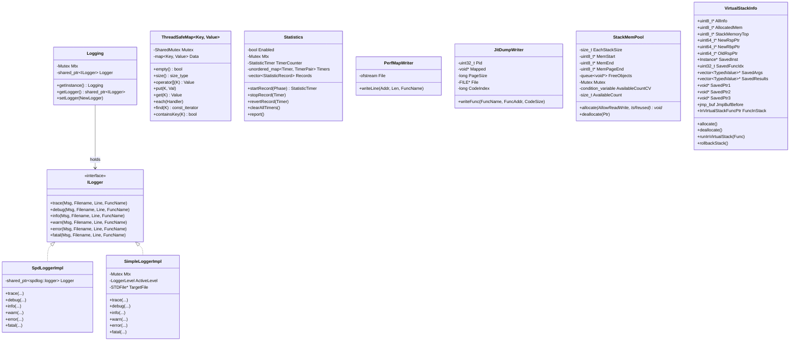

# Utils Module Data Model

## Entity Relationship Diagram

## Core Entities

### Logging

| Field / Method | Type | Description |
|----------------|------|-------------|
| `getInstance()` | `static Logging&` | Singleton access |
| `getLogger()` | `std::shared_ptr<ILogger>` | Current logger; may be null |
| `setLogger(NewLogger)` | `void` | Thread-safe logger replacement |
| `Mtx` | `common::Mutex` | Protects logger switching |
| `Logger` | `std::shared_ptr<ILogger>` | Current implementation |

### ILogger

Pure virtual interface defining six log levels; all methods share the signature `(const std::string& Msg, const char* Filename, int Line, const char* FuncName)`.

### ThreadSafeMap\<Key, Value\>

| Field / Method | Type | Description |
|----------------|------|-------------|
| `Mutex` | `common::SharedMutex` | Reader-writer lock |
| `Data` | `std::map<Key, Value, Compare, Alloc>` | Underlying storage |
| `empty()`, `size()` | Read lock | Same semantics as map |
| `operator[]`, `put`, `get`, `insert`, `emplace`, `erase`, `clear` | Write lock | Write operations |
| `at`, `find`, `containsKey`, `count`, `lowerBound`, `upperBound`, `each` | Read lock | Read operations |

### Statistics

| Field / Method | Type | Description |
|----------------|------|-------------|
| `Enabled` | `bool` | Whether statistics collection is enabled |
| `Mtx` | `common::Mutex` | Protects Timers/Records |
| `TimerCounter` | `StatisticTimer` (uint32_t) | Incrementing timer ID |
| `Timers` | `unordered_map<StatisticTimer, TimerPair>` | Active timers |
| `Records` | `vector<pair<StatisticPhase, float>>` | Completed phase durations (ms) |
| `startRecord(Phase)` | Returns Timer | Start timing |
| `stopRecord(Timer)` | Writes Records and removes Timer | Stop timing |
| `revertRecord(Timer)` | Removes Timer | Cancel timing |
| `report()` | Aggregates and logs | Read-only |

### PerfMapWriter

| Field / Method | Type | Description |
|----------------|------|-------------|
| `File` | `std::ofstream` | Output stream |
| `FilenameFormat` | `"/tmp/perf-%d.map"` | Filename template |
| `writeLine(Addr, Len, FuncName)` | `void` | Writes one map line |

### JitDumpWriter

| Field / Method | Type | Description |
|----------------|------|-------------|
| `Pid` | `uint32_t` | Process ID |
| `Mapped` | `void*` | mmap region (for perf to read) |
| `PageSize` | `long` | Page size |
| `File` | `FILE*` | Binary output |
| `CodeIndex` | `long` | Code segment index |
| `writeFunc(FuncName, FuncAddr, CodeSize)` | `void` | Writes JIT_CODE_LOAD record |

### StackMemPool

| Field / Method | Type | Description |
|----------------|------|-------------|
| `EachStackSize` | `size_t` | Size per stack block (~18MB) |
| `MemStart`, `MemEnd`, `MemPageEnd` | `uint8_t*` | Allocatable range |
| `FreeObjects` | `std::queue<void*>` | Recycled stack blocks |
| `Mutex` | `common::Mutex` | Protects allocation |
| `AvailableCountCV` | `condition_variable` | Wait for available blocks |
| `AvailableCount` | `size_t` | Remaining allocatable count; capped at MAX_STACK_ITEM_NUM |
| `allocate(AllowReadWrite, IsReused)` | `void*` | Allocate one stack block |
| `deallocate(Ptr)` | `void` | Return stack block |

### VirtualStackInfo

| Field / Method | Type | Description |
|----------------|------|-------------|
| `AllInfo` | `uint8_t*` | Metadata (includes NewRsp/OldRsp, etc.) |
| `AllocatedMem` | `uint8_t*` | Memory from StackMemPool |
| `StackMemoryTop` | `uint8_t*` | Stack top (low-address end) |
| `NewRspPtr`, `OldRspPtr`, `NewRbpPtr` | `uint64_t*` | RSP/RBP pointers |
| `SavedInst` | `Instance*` | WASM instance (nullptr in EVM mode) |
| `SavedFuncIdx` | `uint32_t` | Function index |
| `SavedArgs`, `SavedResults` | `vector<TypedValue>*` | Arguments and results |
| `SavedPtr1`, `SavedPtr2`, `SavedPtr3` | `void*` | EVM extensions (EVMInstance, evmc_message, Result) |
| `JmpBufBefore` | `jmp_buf` | setjmp buffer |
| `FuncInStack` | `InVirtualStackFuncPtr` | Function to run on virtual stack |
| `allocate()` / `deallocate()` | | Allocate/release from pool |
| `runInVirtualStack(Func)` | | Switch stack and run Func |
| `rollbackStack()` | | Restore original stack and longjmp |

## Enumerations

### LoggerLevel

| Value | Description |
|-------|-------------|
| Trace | Finest granularity |
| Debug | Debug |
| Info | General information |
| Warn | Warning |
| Error | Error |
| Fatal | Fatal error |
| Off | Logging off |

### StatisticPhase

| Value | Description |
|-------|-------------|
| Load (0) | Module load |
| JITCompilation (1) | JIT compilation |
| JITLazyPrecompilation (2) | JIT lazy precompilation |
| JITLazyFgCompilation (3) | Foreground lazy compilation |
| JITLazyBgCompilation (4) | Background lazy compilation |
| JITLazyReleaseDelay (5) | Lazy release delay |
| MemoryBucketMap (6) | Memory bucket map |
| Instantiation (7) | Instantiation |
| Execution (8) | Execution |
| NumStatisticPhases | Total number of phases |

### RecordType (perf JitDump)

| Value | Description |
|-------|-------------|
| JIT_CODE_LOEAD (0) | Code load record (note spelling LOEAD) |

## DTO / Shared Types

| Type | Definition location | Description |
|------|----------------------|-------------|
| `TimerPair` | Inside Statistics | `pair<StatisticPhase, TimePoint>` |
| `StatisticRecord` | Inside Statistics | `pair<StatisticPhase, float>` |
| `Header` | perf.cpp | JitDump file header (Magic, Version, Size, ElfMach, Pid, Timestamp) |
| `RecordHeader` | perf.cpp | Record header (Type, TotalSize, Timestamp) |
| `RecordCodeLoad` | perf.cpp | Code load record body (Pid, Tid, Vma, CodeAddr, CodeSize, CodeIndex) |
| `common::TypedValue` | common/type.h | WASM typed value; includes `UntypedValue` and `WASMType` |
| `evmc::address` | evmc | 20-byte address |
| `evmc::bytes32` | evmc | 32 bytes |
| `evmc::uint256be` | evmc | Big-endian 256-bit integer |
| `filesystem` | filesystem.h | Alias for `std::filesystem` or `std::experimental::filesystem` |

## Constants

| Constant | Value | Description |
|----------|-------|-------------|
| `MAX_STACK_ITEM_NUM` | 100 | Maximum stack blocks in StackMemPool |
| `MaxCodeSize` | INT32_MAX / 640MB (Occlum) | Total virtual stack mapping size |
| `StackMemorySize` | 9 * 1024 * 1024 | Single virtual stack block size 9MB |
| `MAX_TRACE_LENGTH` | 16 | Maximum backtrace frames (defined in common/defines.h) |
| `RLP_OFFSET_SHORT_STRING` | 0x80 | RLP short string offset |
| `RLP_OFFSET_SHORT_LIST` | 0xc0 | RLP short list offset |
| `HEX_CHARS` | "0123456789ABCDEF" | Hex digit table |
