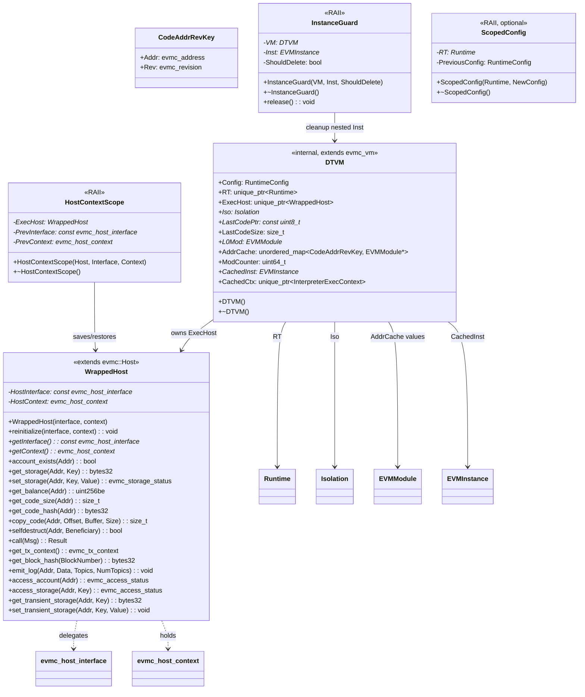

# vm-interface Module Data Model

## Entity Relationship Diagram (Mermaid classDiagram)

## Core Entities

### DTVM

Internal VM implementation class, extends `evmc_vm` (C struct), implements C++ side of EVMC interface.

| Field / Method     | Type | Description |
|-----------------|------|------|
| Config          | RuntimeConfig | Runtime config (Format=EVM, Mode, EnableEvmGasMetering) |
| RT              | std::unique_ptr\<Runtime\> | EVM Runtime, module loading and isolation management |
| ExecHost        | std::unique_ptr\<WrappedHost\> | Host bridge instance, reinitialized before each execute |
| Iso             | Isolation *   | Managed isolation, holds EVMInstance pool |
| LastCodePtr     | const uint8_t * | L0 cache (disabled) state for eviction consistency |
| LastCodeSize    | size_t        | Same as above |
| L0Mod           | EVMModule *   | L0 cached module reference, cleared on eviction |
| AddrCache       | unordered_map\<CodeAddrRevKey, EVMModule*\> | L1 address cache |
| ModCounter      | uint64_t      | Module naming increment counter (mod_0, mod_1, ...) |
| CachedInst      | EVMInstance * | Top-level call reused EVM instance |
| CachedCtx       | unique_ptr\<InterpreterExecContext\> | Interpreter mode reused execution context |
| destroy()       | Static function      | evmc_vm::destroy callback, delete DTVM |
| execute()       | Static function      | evmc_vm::execute callback |
| get_capabilities() | Static function   | Returns EVMC_CAPABILITY_EVM1 |
| set_option()    | Static function      | Parses mode, enable_gas_metering |

### WrappedHost

Bridges C-style `evmc_host_interface` and `evmc_host_context` to C++ `evmc::Host`.

| Field / Method     | Type | Description |
|-----------------|------|------|
| HostInterface   | const evmc_host_interface * | C interface function table from client |
| HostContext     | evmc_host_context * | Context pointer from client |
| reinitialize()  | void | Switch Host interface and context at runtime |
| getInterface()  | const evmc_host_interface * | Read-only access |
| getContext()    | evmc_host_context * | Read-only access |
| *(Host virtual methods)| —    | account_exists, get_storage, set_storage, get_balance, copy_code, call, get_tx_context, get_block_hash, emit_log, access_account, access_storage, get_transient_storage, set_transient_storage, selfdestruct |

### CodeAddrRevKey

L1 address cache key type.

| Field | Type | Description |
|------|------|------|
| Addr | evmc_address | Contract code address (20 bytes) |
| Rev  | evmc_revision | EVM revision (e.g., CANCUN, SHANGHAI) |

### HostContextScope

RAII helper; saves current Host context at execute entry, restores on exit.

| Field | Type | Description |
|------|------|------|
| ExecHost     | WrappedHost * | Managed Host instance |
| PrevInterface| const evmc_host_interface * | Saved interface before entry |
| PrevContext  | evmc_host_context * | Saved context before entry |

### InstanceGuard

RAII helper; ensures temporary `EVMInstance` created for nested calls is freed via `deleteEVMInstance` on exit (including on exception).

| Field | Type | Description |
|------|------|------|
| VM           | DTVM * | Owning VM for accessing Iso |
| Inst         | EVMInstance * | Temporary instance to free |
| ShouldDelete | bool   | Whether to delete in destructor |
| release()    | void   | Relinquish deletion responsibility |

### ScopedConfig

RAII helper (optional, for JIT fallback); temporarily switches RuntimeConfig, restores on destructor.

## Enumerations

| Enum | Source | Description |
|------|------|------|
| evmc_revision | evmc | EVM revision (FRONTIER, HOMESTEAD, …, CANCUN, etc.) |
| evmc_status_code | evmc | Execution status (EVMC_SUCCESS, EVMC_FAILURE, EVMC_OUT_OF_GAS, etc.) |
| evmc_set_option_result | evmc | set_option return (EVMC_SET_OPTION_SUCCESS, EVMC_SET_OPTION_INVALID_NAME, EVMC_SET_OPTION_INVALID_VALUE) |
| evmc_capabilities_flagset | evmc | Capability bits (EVMC_CAPABILITY_EVM1) |
| evmc_storage_status | evmc | Storage write status |
| evmc_access_status | evmc | EIP-2929 access status |
| RunMode | common::enums | InterpMode, MultipassMode, etc. |
| InputFormat | common::enums | EVM, WASM |

## DTO / Shared Types

| Type | Source | Description |
|------|------|------|
| evmc_vm | evmc | VM instance C struct (abi_version, name, version, function pointers) |
| evmc_host_interface | evmc | Host function table (account_exists, get_storage, call, etc.) |
| evmc_host_context | evmc | Opaque context pointer |
| evmc_message | evmc | Call message (kind, flags, depth, gas, sender, destination, value, input, etc.) |
| evmc_result | evmc | Execution result (status_code, gas_left, output_data, release) |
| evmc_address | evmc | 20-byte address |
| evmc_bytes32 | evmc | 32-byte data |
| evmc_tx_context | evmc | Transaction context (block, timestamp, gas_price, etc.) |
| RuntimeConfig | runtime | Format, Mode, EnableEvmGasMetering, etc. |
| CodeAddrRevHash | Internal | Hash functor for CodeAddrRevKey |
| CodeAddrRevEqual | Internal | Equality functor for CodeAddrRevKey |

## External Dependencies (evmc library)

- `evmc::Host`: C++ Host interface base
- `evmc::Result`: C++ result wrapper, includes `release_raw()` for ownership release
- `evmc_make_result()`: Construct failure evmc_result
- `EVMC_EXPORT`: Symbol export macro
- `EVMC_ABI_VERSION`: ABI version constant (12)
